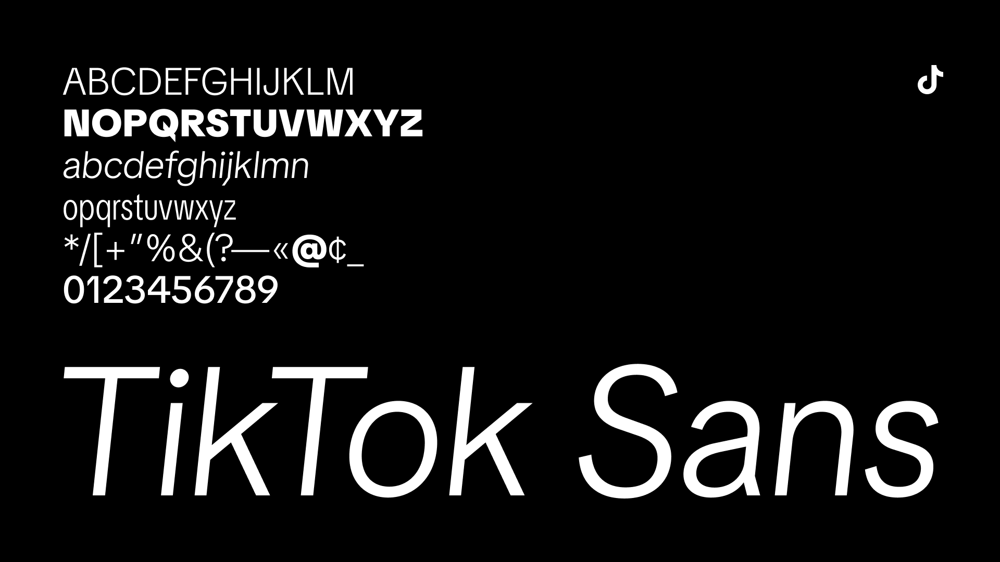

# TikTok Sans

**[Download from Google Fonts ↗︎](https://fonts.google.com/specimen/TikTok+Sans) | [Website ↗︎](https://tiktok.com/font) | [Specimen ↗︎](https://raw.githubusercontent.com/tiktok/TikTokSans/main/documentation/TikTokSans.pdf)**

With its playful, fresh, and dynamic design, TikTok Sans is perfect for making your video captions stand out. You may recognize this font as the default font used in millions of TikTok videos. Bring your creations to life and to amplify your voice with TikTok Sans.

- Supports over 460+ languages for **Latin, Greek,** and **Cyrillic**
- Includes variable font with **Weight, Width, Slant,** and **Optical Size** axes
- Offers tabular numerals, diamiguation stylistic set, character variants, and more
- Optimized for high-DPI mobile UI typesetting
- Features manual TrueType hinting

> Did you create something cool using TikTok Sans? Share it using **#TikTokFont**!

## Language Support

Languages supported by **TikTok Sans** _and_ **TikTok app**: English, Spanish, Portuguese, French, German, Russian, Indonesian, Javanese, Malay, Filipino, Cebuano, Vietnamese, Swahili, Turkish, Kazakh, Uzbek, Polish, Ukrainian, Czech, Slovak, Slovenian, Croatian, Bulgarian, Hungarian, Albanian, Lithuanian, Latvian, Estonian, Finnish, Italian, Romanian, Greek, Catalan, Swedish, Norwegian Bokmål, Danish, Icelandic, Dutch, Irish.

Languages supported by **TikTok app** but _not_ by **TikTok Sans**: Arabic, Hebrew, Hindi, Urdu, Bangla, Thai, Khmer, Burmese, Chinese, Japanese, Korean.

For a complete list of supported languages, visit [our Google Fonts page](https://fonts.google.com/specimen/TikTok+Sans/glyphs).

## Building

To build fonts locally, use the following commands:

- `make dev` will produce only the variable font for testing during development.
- `make build` will produce static and variable fonts in all font file formats (.otf, .ttf, .woff, .woff2).
- `make test` will run [FontBakery](https://github.com/googlefonts/fontbakery)’s quality assurance tests.
- `make proof` will generate HTML proof files.

## Security

If you identify a security issue in this project, do not open a public GitHub issue. Please report it to TikTok through our [Bug Bounty Program](https://hackerone.com/tiktok).

## License

This Font Software is licensed under the SIL Open Font License, Version 1.1. For more details, see [OFL](OFL.txt).

## Credits & Acknowledgements

TikTok Sans is designed and engineered by [Grilli Type](https://www.grillitype.com/), [Contrast Foundry](https://contrastfoundry.com/), and [Type Network](https://typenetwork.com/). It's produced and maintained by [TikTok](https://tiktok.com/about) (Design, Marketing, and Engineering).

For more details, see [Contributors](CONTRIBUTORS.txt).

> _In memory of [Chris Simpkins](https://github.com/chrissimpkins)._

This font repository structure is inspired by [Unified Font Repository v0.3](https://github.com/unified-font-repository/Unified-Font-Repository), modified for the [Google Fonts workflow](https://github.com/googlefonts/googlefonts-project-template).

TikTok is a trademark of TikTok Ltd. Its affiliate, TikTok Inc., has the right to use this mark.

© 2025 TikTok Inc.
